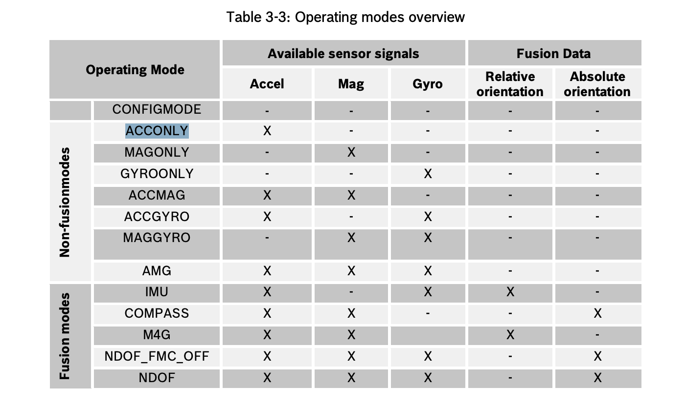
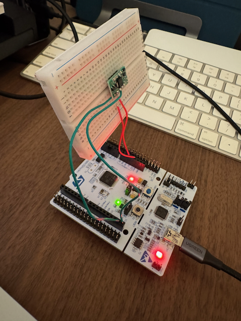
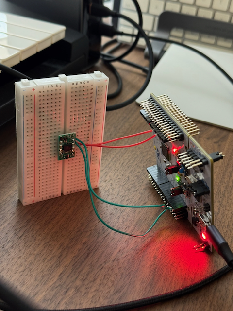
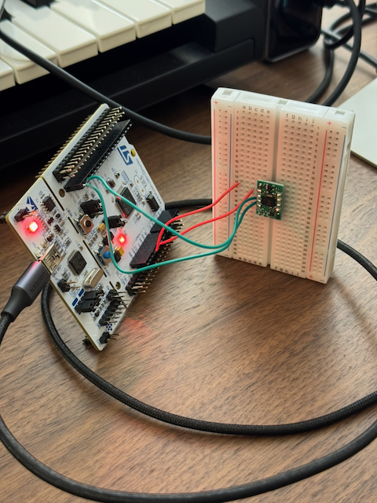
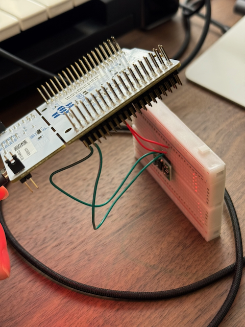
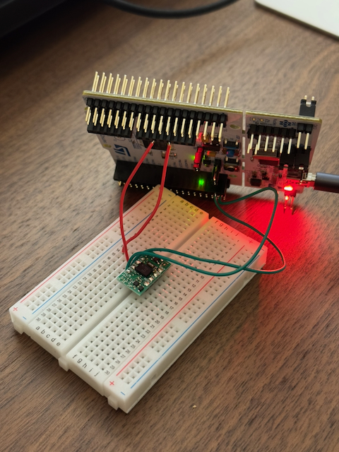
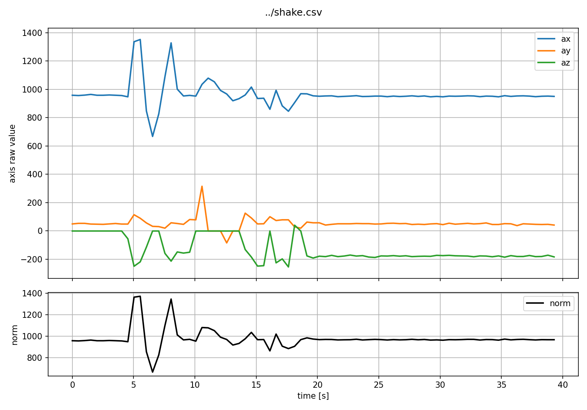

# BNO055 による加速度測定

このサブプロジェクトでは最終的に BNO055 よりも消費電力の小さな IMU を使う予定だが、まずは手元にある BNO055 で簡単に加速度を測定し、本格的な実験の前準備としたい。

## 目的

BNO055 から加速度 ax, ay, az を 100 ms ごとに読み取り、静止・傾ける・軽く揺らすの3条件で記録する。

## 構成

- Nucleo F446RE
- BNO055
- I2C 接続
- UART CSV 出力
- 100 ms 間隔
- 1 分以上の記録

## コード

加速度を読み取る関数を定義していく。

まず必要なプライベート変数を定義する。

```c
/* USER CODE BEGIN PV */
#define BNO055_I2C_ADDR          (0x28 << 1)
#define BNO055_ACCEL_DATA_X_LSB  0x08
/* USER CODE END PV */
```

I2C アドレスは前回スキャンで確定できたとおり 0x28 を使う。ACCEL_DATA_X_LSB はデータシートの Table 4-2 Register Map page 0 から、加速度の X 軸の下位バイトのアドレス定義する。


プロトタイプ宣言

```c
/* USER CODE BEGIN PFP */
HAL_StatusTypeDef bno055_read_accel(int16_t *ax, int16_t *ay, int16_t *az);
/* USER CODE END PFP */
```

関数を定義する。

```c
/* USER CODE BEGIN 4 */
HAL_StatusTypeDef bno055_read_accell(int16_t *ax, int16_t *ay, int16_t *az)
{
	uint8_t buf[6];

	HAL_StatusTypeDef status = HAL_I2C_Mem_read(
		&hi2c1,
		BNO055_I2C_ADDR,
		BNO055_ACCEL_DATA_X_LSB,
		I2C_MEMADD_SIZE_8BIT,
		buf,
		6,
		100
	);

	if (status != HAL_OK)
	{
		return status;
	}

	*ax = (int16_t)((buf[1] << 8) | buf[0]);
	*ay = (int16_t)((buf[3] << 8) | buf[2]);
	*az = (int16_t)((buf[5] << 8) | buf[4]);

	return HAL_OK;
}
/* USER CODE END 4 */
```

加速度レジスタから X/Y/Z軸の6バイトをまとめて読み、int16_t の ax, ay, az に変換する。

関数を呼び出す。

```c
  /* USER CODE BEGIN WHILE */

  printf("timestamp_ms,ax,ay,az\r\n");

  uint32_t start_ms = HAL_GetTick();
  uint32_t last_ms = 0;

  while (1)
  {
	uint32_t now_ms = HAL_GetTick();
	uint32_t elapsed_ms = now_ms - start_ms;

	if ((now_ms - last_ms) >= 100)
	{
		last_ms = now_ms;

		int16_t ax = 0;
		int16_t ay = 0;
		int16_t az = 0;

		if (bno055_read_accel(&ax, &ay, &az) == HAL_OK)
		{
			printf("%lu,%d,%d,%d\r\n",
				   elapsed_ms,
				   ax,
				   ay,
				   az);
		}
		else
		{
			printf("%lu,ERR,ERR,ERR\r\n", elapsed_ms);
		}
	}
    /* USER CODE END WHILE */
```

ビルドして実行、シリアルポートを見る。

```
% ls /dev/cu.usbmodem*
/dev/cu.usbmodem11303
screen /dev/cu.usbmodem1103 115200
```

```
9105,-21,22,-1
9611,-20,22,-1
10117,-19,22,-1
10623,-19,22,956
11129,-19,22,-1
11635,-11,-3,951
12141,-11,19,952
```

こんな調子で重力加速度がたまにしか出ないのでデバッグをする。

なお screen の終了方法は以下

1. Ctrl + A を押す
2. K を押す
3. y を押す

動作モードや生の値を出力するために以下のコードを追加する

プライベート変数

```c
#define BNO055_PAGE_ID           0x07
#define BNO055_OPR_MODE          0x3D

#define BNO055_MODE_CONFIG       0x00
#define BNO055_MODE_AMG          0x07
```

プロトタイプ宣言追加

```c
/* USER CODE BEGIN PFP */
HAL_StatusTypeDef bno055_init_for_accel(void);
HAL_StatusTypeDef bno055_read_accel(int16_t *ax, int16_t *ay, int16_t *az);
HAL_StatusTypeDef bno055_read_u8(uint8_t reg, uint8_t *value);
/* USER CODE END PFP */
```

初期化関数の定義

```c
/* USER CODE BEGIN 4 */
HAL_StatusTypeDef bno055_init_for_accel(void)
{
    HAL_StatusTypeDef status;

    // まず設定モードへ
    status = HAL_I2C_Mem_Write(
        &hi2c1,
        BNO055_I2C_ADDR,
        BNO055_OPR_MODE,
        I2C_MEMADD_SIZE_8BIT,
        (uint8_t[]){BNO055_MODE_CONFIG},
        1,
        100
    );

    if (status != HAL_OK)
    {
        return status;
    }

    HAL_Delay(25);

    // Register Page 0 に戻す
    status = HAL_I2C_Mem_Write(
        &hi2c1,
        BNO055_I2C_ADDR,
        BNO055_PAGE_ID,
        I2C_MEMADD_SIZE_8BIT,
        (uint8_t[]){0x00},
        1,
        100
    );

    if (status != HAL_OK)
    {
        return status;
    }

    HAL_Delay(10);

    // AMGモードへ
    status = HAL_I2C_Mem_Write(
        &hi2c1,
        BNO055_I2C_ADDR,
        BNO055_OPR_MODE,
        I2C_MEMADD_SIZE_8BIT,
        (uint8_t[]){BNO055_MODE_AMG},
        1,
        100
    );

    if (status != HAL_OK)
    {
        return status;
    }

    HAL_Delay(25);

    return HAL_OK;
}
```

printf で UART を出力するためのローレベル関数と、レジスタの生の値を読み取る関数を定義

```c
HAL_StatusTypeDef bno055_read_u8(uint8_t reg, uint8_t *value)
{
    return HAL_I2C_Mem_Read(
        &hi2c1,
        BNO055_I2C_ADDR,
        reg,
        I2C_MEMADD_SIZE_8BIT,
        value,
        1,
        100
    );
}

int _write(int file, char *ptr, int len)
{
    HAL_UART_Transmit(&huart2, (uint8_t *)ptr, len, HAL_MAX_DELAY);
    return len;
}
/* USER CODE END 4 */
```

呼び出し

```c
  /* USER CODE BEGIN 2 */
  I2C_Scan();

  if (bno055_init_for_accel() == HAL_OK)
  {
      printf("BNO055 init OK\r\n");
  }
  else
  {
      printf("BNO055 init ERR\r\n");
  }

  uint8_t chip_id = 0;
  uint8_t page_id = 0;
  uint8_t opr_mode = 0;

  bno055_read_u8(0x00, &chip_id);
  bno055_read_u8(0x07, &page_id);
  bno055_read_u8(0x3D, &opr_mode);

  printf("CHIP_ID=0x%02X PAGE_ID=0x%02X OPR_MODE=0x%02X\r\n",
         chip_id, page_id, opr_mode);
  /* USER CODE END 2 */
```

`bno055_read_accel` の中で生の値も出力

```c
	printf("raw=%02X %02X %02X %02X %02X %02X\r\n",
	       buf[0], buf[1], buf[2], buf[3], buf[4], buf[5]);
```

しかし、chip id 0xa0, page id 0x00, opr mode 0x07、生の上下バイトと変換後の値は一致しているが、まだ重力加速度が出ない。

明日は、動作モードを加速度のみにし、加速度センサーが物理的に正しく動いているかを確認する。
持ち上げたりタイピングしたりしているとたまに正しいそうな重力加速度がZ軸に出ることがあるので、センサー自体は生きているものの、何らかの理由で常に正しい値が見られるようになっていないか、配線などに問題があるのではないか。

---

モードを加速度のみにして、加速度センサー単体で正しく動いているかを検証する。BNO055 は磁気センサー、ジャイロスコープ、センサーフュージョンを備えているが、静止時でも見えるはずの重力が見えていないため、まずは加速度センサー単体で正しい値が取れるかを確認する。

昨日は AMG (accelerometer, magnetometer, gyroscope) モードで動かしていた。これを ACCONLY モードにする。



プライベート変数

```c
/* USER CODE BEGIN PV */
#define BNO055_I2C_ADDR          (0x28 << 1)

#define BNO055_CHIP_ID           0x00
#define BNO055_PAGE_ID           0x07
#define BNO055_ACCEL_DATA_X_LSB  0x08
#define BNO055_OPR_MODE          0x3D

#define BNO055_MODE_CONFIG       0x00
#define BNO055_MODE_ACCONLY      0x01

#define BNO055_ACC_CONFIG        0x08
#define BNO055_ACC_CONFIG_VALUE  0x18
/* USER CODE END PV */
```

初期化関数のさしかえ

```c
HAL_StatusTypeDef bno055_init_for_accel(void)
{
    HAL_StatusTypeDef status;
    uint8_t value;

    // 1. CONFIG mode に入る
    value = BNO055_MODE_CONFIG;
    status = HAL_I2C_Mem_Write(
        &hi2c1,
        BNO055_I2C_ADDR,
        BNO055_OPR_MODE,
        I2C_MEMADD_SIZE_8BIT,
        &value,
        1,
        100
    );

    if (status != HAL_OK)
    {
        return status;
    }

    HAL_Delay(25);

    // 2. Page 1 に切り替える
    value = 0x01;
    status = HAL_I2C_Mem_Write(
        &hi2c1,
        BNO055_I2C_ADDR,
        BNO055_PAGE_ID,
        I2C_MEMADD_SIZE_8BIT,
        &value,
        1,
        100
    );

    if (status != HAL_OK)
    {
        return status;
    }

    HAL_Delay(10);

    // 3. 加速度センサー設定
    value = BNO055_ACC_CONFIG_VALUE;
    status = HAL_I2C_Mem_Write(
        &hi2c1,
        BNO055_I2C_ADDR,
        BNO055_ACC_CONFIG,
        I2C_MEMADD_SIZE_8BIT,
        &value,
        1,
        100
    );

    if (status != HAL_OK)
    {
        return status;
    }

    HAL_Delay(10);

    // 4. Page 0 に戻す
    value = 0x00;
    status = HAL_I2C_Mem_Write(
        &hi2c1,
        BNO055_I2C_ADDR,
        BNO055_PAGE_ID,
        I2C_MEMADD_SIZE_8BIT,
        &value,
        1,
        100
    );

    if (status != HAL_OK)
    {
        return status;
    }

    HAL_Delay(10);

    // 5. ACCONLY mode に入る
    value = BNO055_MODE_ACCONLY;
    status = HAL_I2C_Mem_Write(
        &hi2c1,
        BNO055_I2C_ADDR,
        BNO055_OPR_MODE,
        I2C_MEMADD_SIZE_8BIT,
        &value,
        1,
        100
    );

    if (status != HAL_OK)
    {
        return status;
    }

    HAL_Delay(100);

    return HAL_OK;
}
```

これで加速度センサー単体が動くようになっているはずだが、昨日と同じ出力だった。

ここでセンサーをこのように90度 nucleo ボードに対して傾けてみたところ、 ay 軸方向に -900 程度の加速度が出力されるようになったので、ジャンパ線のソケットへの差し込み方がよくないなどの物理的な原因だったらしい。3V3 や GND にもっと長いジャンパ線を使うべきであった。



記録を保存したい。raw も出力させていたので、この行は消す。

```c
	printf("raw=%02X %02X %02X %02X %02X %02X\r\n",
	       buf[0], buf[1], buf[2], buf[3], buf[4], buf[5]);
```

加速度の記録を保存するには、

```sh
screen /dev/cu.usbmodem1103 115200
```

この画面で Ctrl + A, H を押すと screenlog.0 に保存され始める。止める時も同じ操作。毎回同じファイル名で保存されることに注意。（ただし Shift + h ではなく ただの h を押すと hardcopy.0 という、ターミナルに表示されている範囲だけをハードコピーする。以下の静止状態のログは誤って全てハードコピーになっている）



まずはこの状態で測定してみた。

```
46282,-231,-1,-1
46785,-232,-1,-1
47288,-228,-1,-1
47791,-233,-1,-1
48294,-226,-1,-1
48797,-232,-1,-1
49301,-235,-1,-1
49804,-231,-1,-1
50308,-225,-1,-1
50811,-229,-1,-1
51314,-230,-1,-1
51817,-232,-1,-1
52320,-228,-1,-1
52824,-235,-1,-1
53327,-232,-1,-1
53830,-229,-1,-1
54333,-231,-1,-1
54836,-230,-1,-1
55339,-230,-1,-1
55842,-230,-1,-1
56345,-231,-1,-1
56848,-231,-1,-1
57351,-230,-1,-1
57854,-229,-1,-1
58357,-231,-1,-1
58860,-229,-1,-1
59363,-225,-1,-1
59867,-999,6,-4
```

ax軸に-230前後出ているが、他の軸の値はほぼなく、重力が見えているとは言い難い。

この向きで -200 が出るということは、センサーの上下を変えると ax の値は正になるはずである。



[ax.csv](ax.csv)

```
516911,964,46,-1
517415,964,44,-1
517918,963,43,-1
518422,962,42,-1
518926,966,47,-31
519430,970,46,-1
519934,955,48,-1
520438,962,42,-25
520942,966,49,-1
521445,962,45,-1
521949,966,47,-1
522453,962,44,-1
522957,963,46,-1
523460,962,49,-1
523963,963,45,-1
524467,961,41,-1
524971,965,49,-1
525474,958,48,-1
525978,965,47,-1
526482,964,39,-1
526986,960,45,-1
527490,964,48,-1
527993,962,44,-1
528496,969,45,-1
529000,963,43,-22
529504,961,44,-1
530008,963,44,-22
530512,965,43,-24
```

今度は +960 前後が出た。 ay にも 40 少し出ている。この向きはうまくいきやすいらしい。

ay でも正の値を測ってみたい。



[ay.csv](ay.csv)

```
814642,-20,1013,-1
815146,-30,1007,-1
815650,-26,1011,-1
816154,-30,1014,-1
816658,-26,1009,-1
817162,-28,1003,-1
817666,-26,1011,-1
818170,-29,1013,-1
818674,-26,1017,-1
819178,-25,1007,2
819682,-24,1007,6
820186,-24,1011,-1
820690,-29,1007,13
821194,-28,1012,7
821698,-26,1011,18
822202,-22,1015,3
822706,-29,1008,22
823210,-26,1004,30
823714,-29,1016,13
824218,-25,1016,28
824722,-25,1014,17
825226,-28,1012,8
825730,-25,1006,22
826234,-23,1014,8
826738,-31,1017,12
827242,-29,1022,-1
827746,-19,1014,19
828250,-21,986,18
```

ay に 1000 強の値が出て、azも少し、ax には -30 程度が出ている。少なくともこの時の地面への向きが y 軸の正の方向に該当するとわかる。

az は当初から難航していたとおり、なかなかそれらしい値は出なかった。 az だけ測るのが難しい状態になっているらしい。たまに970前後の値が出る瞬間はあるが、継続的には出ない。



[az.csv](az.csv)

```
1370964,-20,54,-1
1371468,-22,54,-1
1371972,-22,52,-1
1372476,-21,58,-1
1372980,-25,59,975
1373484,-21,60,-1
1373988,-21,56,-1
1374492,-28,52,-1
1374996,-23,52,969
1375500,-20,61,977
1376004,-19,54,-1
1376508,-23,55,-1
1377012,-24,59,-1
1377516,-24,57,-1
1378020,-19,51,975
1378524,-20,58,971
1379028,-22,51,-1
1379532,-17,55,-1
1380036,-23,55,-1
1380540,-27,55,-1
1381044,-24,56,-1
1381548,-22,62,-1
1382052,-25,53,-1
1382556,-25,55,-1
1383060,-23,61,975
1383564,-22,63,-1
1384068,-20,59,-1
1384572,-27,57,-1
```

ここまでは静止状態で測定した。次は、以下のような動作をした際のログを取る。

- 静止
- ゆっくりと傾ける
- 傾けた状態をキープ
- ゆっくりと戻す

az 軸が絡むとわかりにくくなるので、ax, ay で測れるような動作をする。x 軸が地面に対して垂直な状態から、 y 軸が地面に対して垂直な状態まで、ゆっくりと傾けて戻す。

[動画リンク](https://www.youtube.com/watch?v=6H59ELioNw0)

[tilt.csv](tilt.csv)
（一部抜粋）

```
395917,961,58,-1
396420,963,55,-1
396923,961,62,-1
397426,958,55,-180
397930,955,56,-108
398434,961,45,-1
398938,958,48,-1
399442,960,49,-1
399946,962,44,-1
400450,968,50,-1
400954,978,110,-83
401458,920,277,-1
401962,849,539,-1
402466,776,633,-82
402970,725,709,-1
403474,577,807,-70
403978,443,-1,-1
404482,275,-1,-1
404985,49,-1,-1
405488,12,-1,-1
405991,-23,1013,-91
406495,-23,1004,-1
406999,-21,1012,-85
407503,-24,1006,-1
408007,-23,1009,-1
408511,-22,1005,-1
409015,-21,999,-1
409519,-28,1002,-1
410023,-27,998,-1
410527,-23,1003,-1
411031,-26,1007,-1
411535,-21,1005,-1
412039,-20,1001,-1
412543,-23,1005,-84
413047,-27,996,-1
413551,141,-1,-1
414054,364,-1,-1
414557,529,820,-1
415061,696,-1,-1
415564,833,543,-1
416068,916,331,5
416572,955,-1,-1
417075,965,67,-1
417579,954,64,-1
418083,965,47,-70
418587,957,50,-1
```

重力方向が x -> y -> x と変わっているのがわかる。傾けた状態をキープしている間は、y 軸に 1000 前後の値が出ている。

最後に少し揺らした時のログを取る。

[動画リンク](https://www.youtube.com/watch?v=7OFc0iDVOik)

[shake.csv](shake.csv)
（一部抜粋）

```
7549,958,49,-1
8052,956,53,-1
8555,959,53,-1
9058,964,48,-1
9562,958,47,-1
10065,958,46,-1
10568,960,49,-1
11072,958,52,-1
11576,956,48,-1
12080,947,48,-56
12584,1336,114,-250
13088,1352,89,-219
13592,847,56,-115
14096,667,32,-1
14600,826,30,-1
15103,1088,19,-159
15607,1328,57,-214
16111,1001,52,-149
16615,953,46,-157
17119,957,80,-151
17623,952,78,-1
18127,1035,315,-1
18631,1079,-1,-1
19134,1053,-1,-1
19638,992,-1,-1
20141,967,-85,-1
20644,919,-1,-1
21147,934,-1,-1
21650,960,125,-132
22154,1016,91,-185
22658,935,49,-249
23162,937,50,-246
23666,859,100,-1
24169,993,73,-226
24673,883,78,-198
25177,845,78,-255
25681,906,28,40
26184,969,19,-1
26687,968,62,-177
27191,954,57,-192
27695,951,57,-179
28199,953,41,-182
28703,954,46,-173
29207,948,50,-182
29711,950,50,-178
30215,952,50,-171
30719,955,52,-178
31223,949,51,-175
31727,950,51,-185
32231,952,48,-188
32735,952,49,-177
```

polarsとmatplotlibでシンプルな[plotスクリプト](plot/main.py)を書いてプロットしてみる。



上が各軸の値で、下が norm。x軸についていえば最初の3秒程度は揺れていそうだが、それ以外の軸方向での揺れはあまり判然としない結果になった。

このプロジェクトの実用的な目的の一つに通常とは異なる揺れの検出があるので、まずは揺れをより正確に測定する適切な方法を見つけたい。現時点で分かったこととしては、サンプリング周期が 500 ms だと小刻みな揺れは分かり難いという点がある。