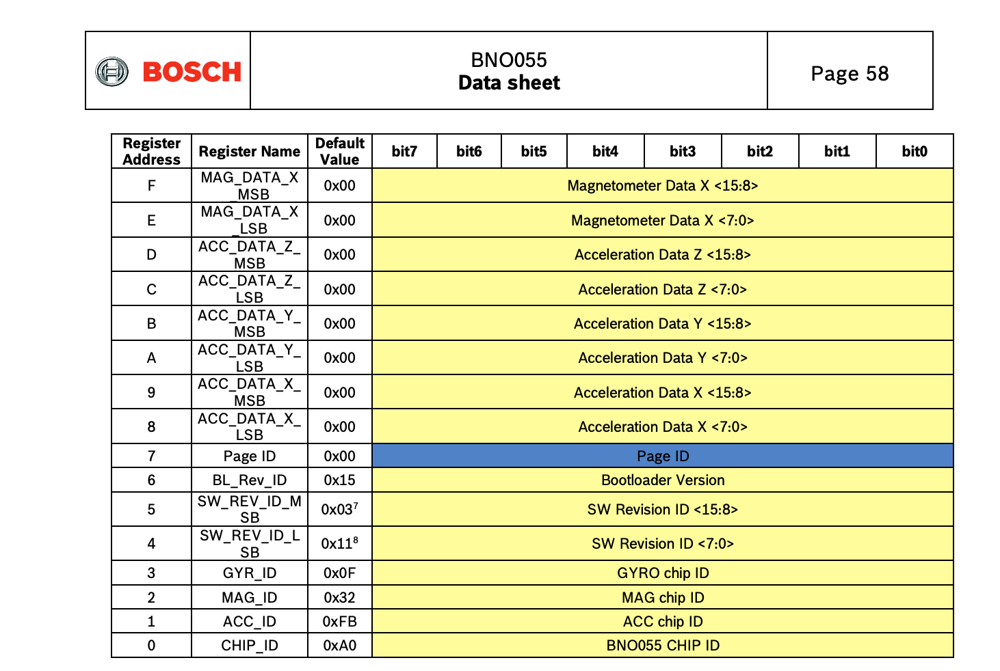

# BNO055 による加速度測定

このサブプロジェクトでは最終的に BNO055 よりも消費電力の小さな IMU を使う予定だが、まずは手元にある BNO055 で簡単に加速度を測定し、本格的な実験の前準備としたい。

## 目的

BNO055 から加速度 ax, ay, az を 100 ms ごとに読み取り、静止・傾ける・軽く揺らすの3条件で記録する。

## 構成

- Nucleo F446RE
- BNO055
- I2C 接続
- UART CSV 出力
- 100 ms 間隔
- 1 分以上の記録

## コード

加速度を読み取る関数を定義していく。

まず必要なプライベート変数を定義する。

```c
/* USER CODE BEGIN PV */
#define BNO055_I2C_ADDR          (0x28 << 1)
#define BNO055_ACCEL_DATA_X_LSB  0x08
/* USER CODE END PV */
```

I2C アドレスは前回スキャンで確定できたとおり 0x28 を使う。ACCEL_DATA_X_LSB はデータシートの Table 4-2 Register Map page 0 から、加速度の X 軸の下位バイトのアドレス定義する。



プロトタイプ宣言

```c
/* USER CODE BEGIN PFP */
HAL_StatusTypeDef bno055_read_accel(int16_t *ax, int16_t *ay, int16_t *az);
/* USER CODE END PFP */
```

関数を定義する。

```c
/* USER CODE BEGIN 4 */
HAL_StatusTypeDef bno055_read_accell(int16_t *ax, int16_t *ay, int16_t *az)
{
	uint8_t buf[6];

	HAL_StatusTypeDef status = HAL_I2C_Mem_read(
		&hi2c1,
		BNO055_I2C_ADDR,
		BNO055_ACCEL_DATA_X_LSB,
		I2C_MEMADD_SIZE_8BIT,
		buf,
		6,
		100
	);

	if (status != HAL_OK)
	{
		return status;
	}

	*ax = (int16_t)((buf[1] << 8) | buf[0]);
	*ay = (int16_t)((buf[3] << 8) | buf[2]);
	*az = (int16_t)((buf[5] << 8) | buf[4]);

	return HAL_OK;
}
/* USER CODE END 4 */
```

加速度レジスタから X/Y/Z軸の6バイトをまとめて読み、int16_t の ax, ay, az に変換する。

関数を呼び出す。

```c
  /* USER CODE BEGIN WHILE */

  printf("timestamp_ms,ax,ay,az\r\n");

  uint32_t start_ms = HAL_GetTick();
  uint32_t last_ms = 0;

  while (1)
  {
	uint32_t now_ms = HAL_GetTick();
	uint32_t elapsed_ms = now_ms - start_ms;

	if ((now_ms - last_ms) >= 100)
	{
		last_ms = now_ms;

		int16_t ax = 0;
		int16_t ay = 0;
		int16_t az = 0;

		if (bno055_read_accel(&ax, &ay, &az) == HAL_OK)
		{
			printf("%lu,%d,%d,%d\r\n",
				   elapsed_ms,
				   ax,
				   ay,
				   az);
		}
		else
		{
			printf("%lu,ERR,ERR,ERR\r\n", elapsed_ms);
		}
	}
    /* USER CODE END WHILE */
```

ビルドして実行、シリアルポートを見る。

```
% ls /dev/cu.usbmodem*
/dev/cu.usbmodem11303
screen /dev/cu.usbmodem1103 115200
```

```
9105,-21,22,-1
9611,-20,22,-1
10117,-19,22,-1
10623,-19,22,956
11129,-19,22,-1
11635,-11,-3,951
12141,-11,19,952
```

こんな調子で重力加速度がたまにしか出ないのでデバッグをする。

なお screen の終了方法は以下

1. Ctrl + A を押す
2. K を押す
3. y を押す

動作モードや生の値を出力するために以下のコードを追加する

プライベート変数

```c
#define BNO055_PAGE_ID           0x07
#define BNO055_OPR_MODE          0x3D

#define BNO055_MODE_CONFIG       0x00
#define BNO055_MODE_AMG          0x07
```

プロトタイプ宣言追加

```c
/* USER CODE BEGIN PFP */
HAL_StatusTypeDef bno055_init_for_accel(void);
HAL_StatusTypeDef bno055_read_accel(int16_t *ax, int16_t *ay, int16_t *az);
HAL_StatusTypeDef bno055_read_u8(uint8_t reg, uint8_t *value);
/* USER CODE END PFP */
```

初期化関数の定義

```c
/* USER CODE BEGIN 4 */
HAL_StatusTypeDef bno055_init_for_accel(void)
{
    HAL_StatusTypeDef status;

    // まず設定モードへ
    status = HAL_I2C_Mem_Write(
        &hi2c1,
        BNO055_I2C_ADDR,
        BNO055_OPR_MODE,
        I2C_MEMADD_SIZE_8BIT,
        (uint8_t[]){BNO055_MODE_CONFIG},
        1,
        100
    );

    if (status != HAL_OK)
    {
        return status;
    }

    HAL_Delay(25);

    // Register Page 0 に戻す
    status = HAL_I2C_Mem_Write(
        &hi2c1,
        BNO055_I2C_ADDR,
        BNO055_PAGE_ID,
        I2C_MEMADD_SIZE_8BIT,
        (uint8_t[]){0x00},
        1,
        100
    );

    if (status != HAL_OK)
    {
        return status;
    }

    HAL_Delay(10);

    // AMGモードへ
    status = HAL_I2C_Mem_Write(
        &hi2c1,
        BNO055_I2C_ADDR,
        BNO055_OPR_MODE,
        I2C_MEMADD_SIZE_8BIT,
        (uint8_t[]){BNO055_MODE_AMG},
        1,
        100
    );

    if (status != HAL_OK)
    {
        return status;
    }

    HAL_Delay(25);

    return HAL_OK;
}
```

printf で UART を出力するためのローレベル関数と、レジスタの生の値を読み取る関数を定義

```c
HAL_StatusTypeDef bno055_read_u8(uint8_t reg, uint8_t *value)
{
    return HAL_I2C_Mem_Read(
        &hi2c1,
        BNO055_I2C_ADDR,
        reg,
        I2C_MEMADD_SIZE_8BIT,
        value,
        1,
        100
    );
}

int _write(int file, char *ptr, int len)
{
    HAL_UART_Transmit(&huart2, (uint8_t *)ptr, len, HAL_MAX_DELAY);
    return len;
}
/* USER CODE END 4 */
```

呼び出し

```c
  /* USER CODE BEGIN 2 */
  I2C_Scan();

  if (bno055_init_for_accel() == HAL_OK)
  {
      printf("BNO055 init OK\r\n");
  }
  else
  {
      printf("BNO055 init ERR\r\n");
  }

  uint8_t chip_id = 0;
  uint8_t page_id = 0;
  uint8_t opr_mode = 0;

  bno055_read_u8(0x00, &chip_id);
  bno055_read_u8(0x07, &page_id);
  bno055_read_u8(0x3D, &opr_mode);

  printf("CHIP_ID=0x%02X PAGE_ID=0x%02X OPR_MODE=0x%02X\r\n",
         chip_id, page_id, opr_mode);
  /* USER CODE END 2 */
```

`bno055_read_accel` の中で生の値も出力

```c
	printf("raw=%02X %02X %02X %02X %02X %02X\r\n",
	       buf[0], buf[1], buf[2], buf[3], buf[4], buf[5]);
```

しかし、chip id 0xa0, page id 0x00, opr mode 0x07、生の上下バイトと変換後の値は一致しているが、まだ重力加速度が出ない。

明日は、動作モードを加速度のみにし、加速度センサーが物理的に正しく動いているかを確認する。
持ち上げたりタイピングしたりしているとたまに正しいそうな重力加速度がZ軸に出ることがあるので、センサー自体は生きているものの、何らかの理由で常に正しい値が見られるようになっていないか、配線などに問題があるのではないか。
