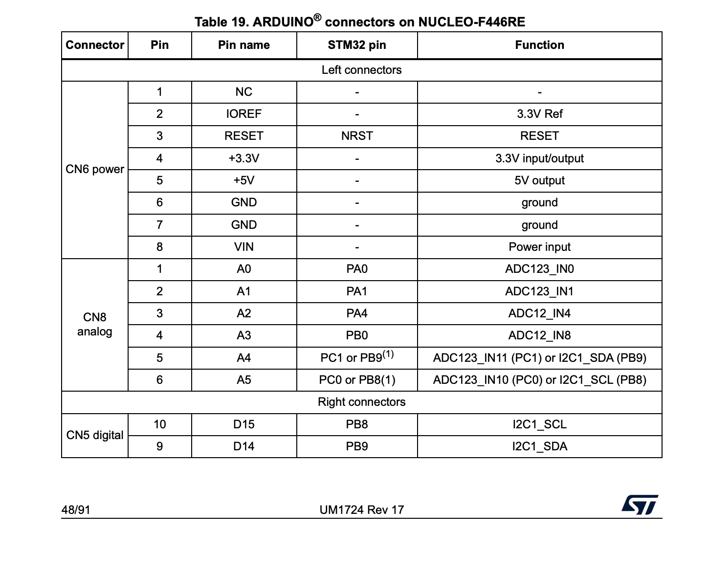
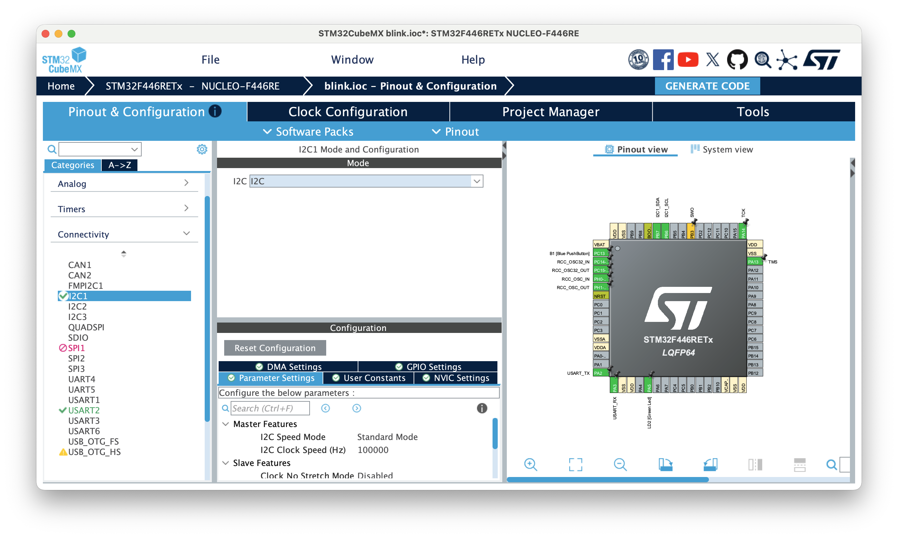
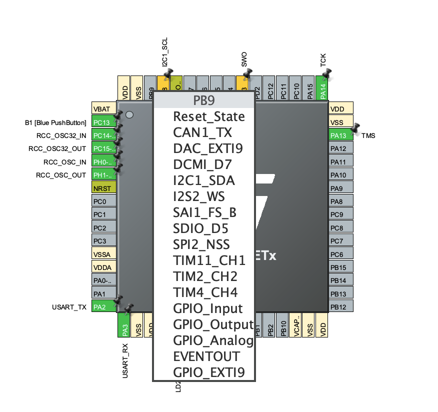

# BNO055 との I2C 通信の簡単な確認

プロジェクトを本格に開始する前に、元々手元にあった NUCLEO F446RE と BNO055 を I2C で接続して、通信ができるかどうかを確認した。

## BNO055 の用意

BNO055 はキット売りされていた物のヘッダピンをはんだ付けした。

事前にデジタルマルチメーターで導通確認をして、隣接するピンが短絡していないことを確認した。

## F446RE と BNO055

STM の NUCLEO F446RE と、ブレッドボードに載せた BNO055 を並べた様子。

（ブレッドボードに触るのが初めてだったため、実はこの時点では BNO055 はブレッドボードの上に乗っかっているだけで、ピンがブレッドボードの板ばねに刺さっていなかった）

## 配線

F446RE と BNO055 を I2C で接続するには、以下のように配線する必要がある。

| F446RE ピン | BNO055 ピン | 役割             |
| ----------- | ----------- | ---------------- |
| PB8         | SDA/T       | シリアルデータ   |
| PB9         | SCL/R       | シリアルクロック |
| GND         | GND         | グランド         |
| 3V3         | VIN         | 電源             |

BNO055 側は1枚目の画像の左側にあるピンだけを使う。

F446RE 側は、シリアル通信に2枚目の写真におけるボード右側のピンソケット一番上 SCL/D15 と上から2番目 SDA/D14 を使う。ボード左側の GND, 3V3 も使う。

実際に配線した写真。

（この写真ではピンはちゃんと各ソケットの板ばねに刺さっている。ブレッドボードもNucleoの穴も意外とグッと押し込むと金属の板ばね接点にシュッと入っていく感触がある）

[マニュアル](https://www.st.com/resource/en/user_manual/um1724-stm32-nucleo64-boards-mb1136-stmicroelectronics.pdf)を見ることで、どのピンが何に対応しているかわかる。

この画像ではCubeMXでI2Cを選択したところ PB7, PB6 が緑色になった。上の表のように本来なら PB8, PB9 を使うべきなので、ピンを右クリックして state reset を行ったのち、PB8, 9 それぞれをクリックしてI2Cで使うピンに正しく設定した。

