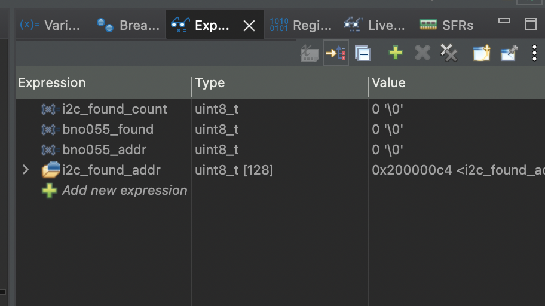
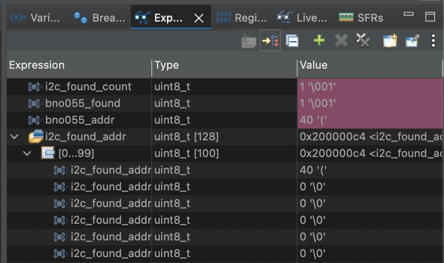
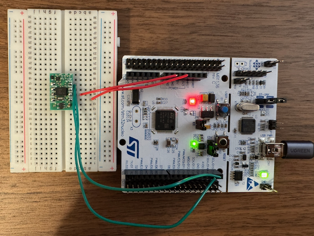

# BNO055 との I2C 通信の簡単な確認

プロジェクトを本格に開始する前に、元々手元にあった NUCLEO F446RE と BNO055 を I2C で接続して、通信ができるかどうかを確認した。

## BNO055 の用意

BNO055 はキット売りされていた物のヘッダピンをはんだ付けした。


事前にデジタルマルチメーターで導通確認をして、隣接するピンが短絡していないことを確認した。

## F446RE と BNO055

STM の NUCLEO F446RE と、ブレッドボードに載せた BNO055 を並べた様子。


（ブレッドボードに触るのが初めてだったため、実はこの時点では BNO055 はブレッドボードの上に乗っかっているだけで、ピンがブレッドボードの板ばねに刺さっていなかった）

## 配線

F446RE と BNO055 を I2C で接続するには、以下のように配線する必要がある。

| F446RE ピン | BNO055 ピン | 役割             |
| ----------- | ----------- | ---------------- |
| PB8         | SDA/T       | シリアルデータ   |
| PB9         | SCL/R       | シリアルクロック |
| GND         | GND         | グランド         |
| 3V3         | VIN         | 電源             |

BNO055 側は1枚目の画像の左側にあるピンだけを使う。

F446RE 側は、シリアル通信に2枚目の写真におけるボード右側のピンソケット一番上 SCL/D15 と上から2番目 SDA/D14 を使う。ボード左側の GND, 3V3 も使う。

実際に配線した写真。


（この写真ではピンはちゃんと各ソケットの板ばねに刺さっている。ブレッドボードもNucleoの穴も意外とグッと押し込むと金属の板ばね接点にシュッと入っていく感触がある）

USB で PC に繋ぐ前に BNO055 の VIN と GND が導通しないことをテスターで確認した。これにより、 VIN と GND のジャンパ線を同じ横列に刺したり、ジャンパ線が隣の端子に接触していたりして、 Nucleo の電源線と GND がショートして過大な電流が流れることを防止できる。

## コードの実装

[マニュアル](https://www.st.com/resource/en/user_manual/um1724-stm32-nucleo64-boards-mb1136-stmicroelectronics.pdf)を見ることで、ボードのどのピンが何の機能に対応しているかがわかる。


この画像ではCubeMXでI2Cを選択したところ PB7, PB6 が緑色になった。上の表のように本来なら PB8, PB9 を使うべきなので、ピンを右クリックして state reset を行ったのち、PB8, 9 それぞれをクリックしてI2Cで使うピンに正しく設定した。


MX で保存して generate code すると Core/src/main.c にI2C関係の初期化関数 `MX_I2C1_Init` や HAL (Hardware Abstraction Layer) ハンドルが現れる。

```c
/* Private function prototypes -----------------------------------------------*/
void SystemClock_Config(void);
static void MX_GPIO_Init(void);
static void MX_USART2_UART_Init(void);
static void MX_I2C1_Init(void);
```

```c
/* Private variables ---------------------------------------------------------*/
I2C_HandleTypeDef hi2c1;

UART_HandleTypeDef huart2;
```

これがあるということは I2C は使える状態になっているはず。

BNO055 の[データシート](https://www.bosch-sensortec.com/media/boschsensortec/downloads/datasheets/bst-bno055-ds000.pdf) 4.6 I2C Protocol によれば、BNO055 の I2C slave としてのデフォルトアドレスは 0x29 で、 COM3 というピンが LOW のときは 0x28 になる。

実際にどのアドレスで BNO055 が通信に応答するかを確認するため、 I2C バスに接続されている部品を総当たりでアドレススキャンする関数を定義した。

```c
/* Private user code ---------------------------------------------------------*/
/* USER CODE BEGIN 0 */

uint8_t i2c_found_addr[128];
uint8_t i2c_found_count = 0;
uint8_t bno055_found = 0;
uint8_t bno055_addr = 0;

void I2C_Scan(void)
{
	i2c_found_count = 0;
	bno055_found = 0;
	bno055_addr = 0;

	for (uint8_t addr = 1; addr < 128; addr++)
	{
		if (HAL_I2C_IsDeviceReady(&hi2c1, (uint16_t)(addr << 1), 2, 10) == HAL_OK)
		{
			i2c_found_addr[i2c_found_count] = addr;
			i2c_found_count++;

			if (addr == 0x28 || addr == 0x29)
			{
				bno055_found = 1;
				bno055_addr = addr;
			}
		}
	}
}

/* USER CODE END 0 */
```

main 関数でペリフェラルの初期化ができた後でこの関数を呼び出す。

```c
  /* Initialize all configured peripherals */
  MX_GPIO_Init();
  MX_USART2_UART_Init();
  MX_I2C1_Init();
  /* USER CODE BEGIN 2 */
  I2C_Scan();
  /* USER CODE END 2 */
```

main 関数のループ部分で結果を示すために LED を光らせる。

```c
  /* Infinite loop */
  /* USER CODE BEGIN WHILE */
  while (1)
  {
    /* USER CODE END WHILE */

    /* USER CODE BEGIN 3 */
    if (bno055_found) {
      HAL_GPIO_TogglePin(GPIOA, GPIO_PIN_5);
      HAL_Delay(500); // found. blink slowly
    }
    else
    {
      HAL_GPIO_TogglePin(GPIOA, GPIO_PIN_5);
      HAL_Delay(100); // not found: blink fast
    }
  }
  /* USER CODE END 3 */
```

デバッグで変数の値を見たいので、スキャン完了直後にブレークポイントを置くための行を置いておく。（未使用変数なのでコンパイルで警告が表示される。なお、 `volatile` をつけることで最適化による削除や順序変更の影響を避けている）

```c
  /* USER CODE BEGIN 2 */
  I2C_Scan();
  volatile uint8_t scan_done = 1;
  /* USER CODE END 2 */
```

## I2C スキャンの実行

実行前の状態



実行後の状態



- `i2c_found_count` が1だったことから I2C で応答があったのは1つのみ、
- かつ `bno055_found` が1だったことから BNO055 のアドレスの1つが応答し、
- そのアドレスは `bno055_addr` で、40 (0x28) だったことがわかる。

なお i2c_found_addr を見てみると、 0x28 以外のアドレスは見つかっていないことがわかる。

正しいアドレスが見つかったので、 LD2 はゆっくり点滅していた。（写真は静止画）


