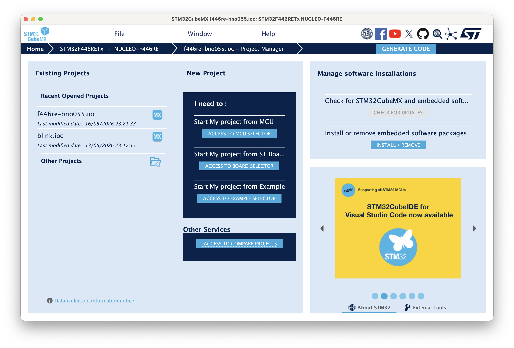
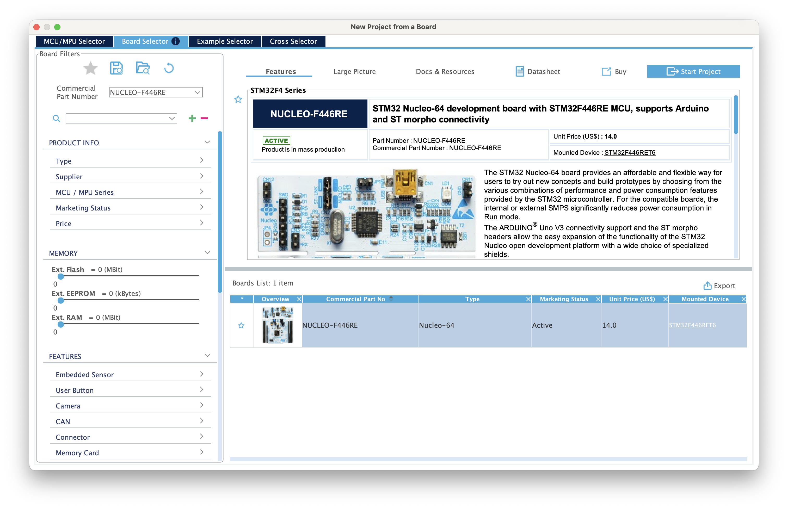
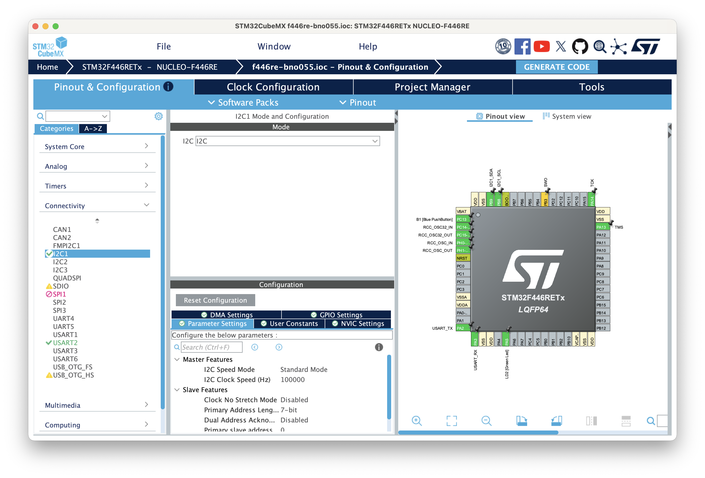
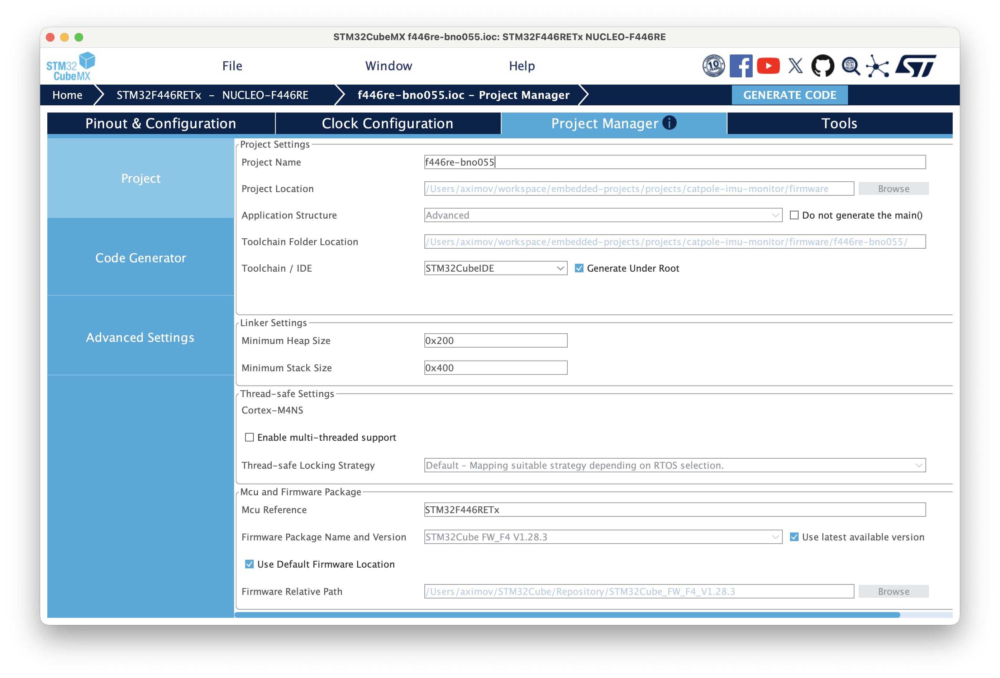
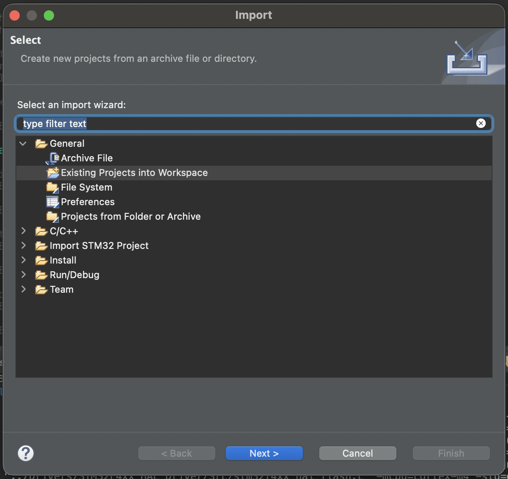
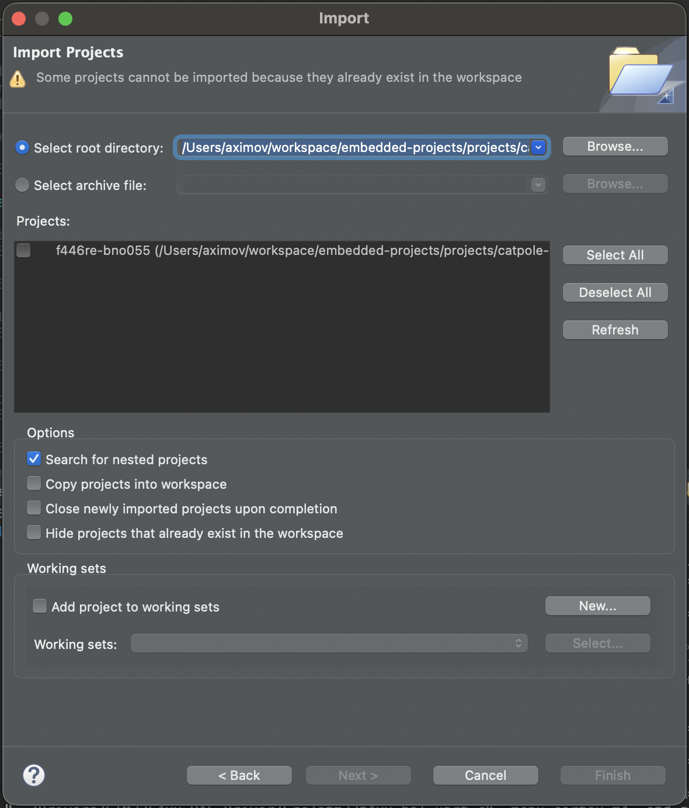
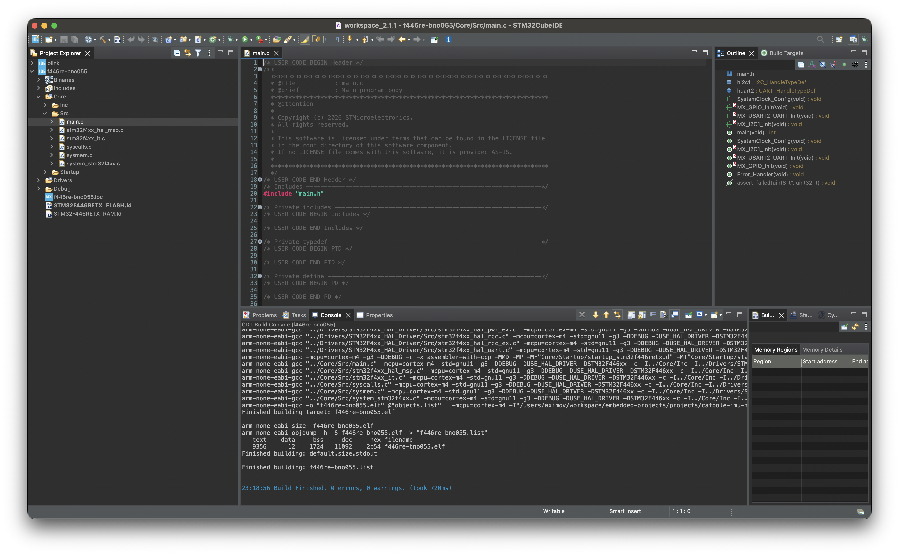

# STM32CubeIDE プロジェクトのセットアップ

前提

- macOS
- STM32CubeMX 6.17.0
- STM32CubeIDE 2.1.1
- NUCLEO-F446RE などの STM ボード

## 1. MX でのプロジェクトの作成

### 作成

STM32CubeMX を起動して、Home 画面の New Project > Start My Project from ST Board を選択



使用したいボードを左上の検索ボックスで入力し、右下で選択、右上の Start project をクリック



Initialize all peripherals with their default Mode? と聞かれるが、これはボードのペリフェラルを既定の設定で初期化するかという確認で、通常は Yes にすべきだと思う。例えば、F446RE の場合、No と答えた場合と Yes と答えた場合で次のような差分が ioc ファイルに発生する。

<details>

<summary>差分</summary>

```diff
< NVIC.SysTick_IRQn=true\:0\:0\:false\:false\:true\:true\:true\:false
< NVIC.UsageFault_IRQn=true\:0\:0\:false\:false\:true\:false\:false\:false
---
> NVIC.SysTick_IRQn=true\:0\:0\:true\:false\:true\:true\:true\:false
> NVIC.UsageFault_IRQn=true\:0\:0\:false\:false\:true\:true\:false\:false
44a48
> PA13.Mode=Serial_Wire
48a53
> PA14.Mode=Serial_Wire
52a58
> PA2.Mode=Asynchronous
56a63
> PA3.Mode=Asynchronous
71a79
> PC14-OSC32_IN.Mode=LSE-External-Oscillator
73a82
> PC15-OSC32_OUT.Mode=LSE-External-Oscillator
83a93
> PH0-OSC_IN.Mode=HSE-External-Oscillator
85a96
> PH1-OSC_OUT.Mode=HSE-External-Oscillator
110,111c121,122
< ProjectManager.ProjectFileName=test2.ioc
< ProjectManager.ProjectName=test2
---
> ProjectManager.ProjectFileName=test3.ioc
> ProjectManager.ProjectName=test3
120c131,132
< ProjectManager.functionlistsort=1-SystemClock_Config-RCC-false-HAL-false,2-MX_GPIO_Init-GPIO-false-HAL-true
---
> ProjectManager.functionlistsort=1-SystemClock_Config-RCC-false-HAL-false,2-MX_GPIO_Init-GPIO-false-HAL-true,3-MX_USART2_UART_Init-USART2-false-HAL-true
> RCC.48MHZClocksFreq_Value=84000000
128a141
> RCC.EthernetFreq_Value=84000000
136,137c149,150
< RCC.IPParameters=AHBFreq_Value,APB1CLKDivider,APB1Freq_Value,APB1TimFreq_Value,APB2Freq_Value,APB2TimFreq_Value,CECFreq_Value,CortexFreq_Value,FCLKCortexFreq_Value,FLatency-AdvancedSettings,FMPI2C1Freq_Value,FamilyName,HCLKFreq_Value,HSE_VALUE,HSI_VALUE,LSE_VALUE,LSI_VALUE,MCO2PinFreq_Value,PLLCLKFreq_Value,PLLI2SPCLKFreq_Value,PLLI2SQCLKFreq_Value,PLLI2SRCLKFreq_Value,PLLN,PLLP,PLLQCLKFreq_Value,PLLRCLKFreq_Value,PLLSAIPCLKFreq_Value,PLLSAIQCLKFreq_Value,PWRFreq_Value,SAIAFreq_Value,SAIBFreq_Value,SDIOFreq_Value,SPDIFRXFreq_Value,SYSCLKFreq_VALUE,SYSCLKSource,USBFreq_Value,VCOI2SInputFreq_Value,VCOI2SOutputFreq_Value,VCOInputFreq_Value,VCOOutputFreq_Value,VCOSAIInputFreq_Value,VCOSAIOutputFreq_Value,VcooutputI2S
< RCC.LSE_VALUE=32768
---
> RCC.I2SClocksFreq_Value=96000000
> RCC.IPParameters=48MHZClocksFreq_Value,AHBFreq_Value,APB1CLKDivider,APB1Freq_Value,APB1TimFreq_Value,APB2Freq_Value,APB2TimFreq_Value,CECFreq_Value,CortexFreq_Value,EthernetFreq_Value,FCLKCortexFreq_Value,FLatency-AdvancedSettings,FMPI2C1Freq_Value,FamilyName,HCLKFreq_Value,HSE_VALUE,HSI_VALUE,I2SClocksFreq_Value,LSI_VALUE,MCO2PinFreq_Value,PLLCLKFreq_Value,PLLI2SPCLKFreq_Value,PLLI2SQCLKFreq_Value,PLLI2SRCLKFreq_Value,PLLN,PLLP,PLLQCLKFreq_Value,PLLRCLKFreq_Value,PLLSAIPCLKFreq_Value,PLLSAIQCLKFreq_Value,PWRFreq_Value,RTCFreq_Value,RTCHSEDivFreq_Value,SAIAFreq_Value,SAIBFreq_Value,SDIOFreq_Value,SPDIFRXFreq_Value,SYSCLKFreq_VALUE,SYSCLKSource,USBFreq_Value,VCOI2SInputFreq_Value,VCOI2SOutputFreq_Value,VCOInputFreq_Value,VCOInputMFreq_Value,VCOOutputFreq_Value,VCOSAIInputFreq_Value,VCOSAIOutputFreq_Value,VcooutputI2S
150a164,165
> RCC.RTCFreq_Value=32000
> RCC.RTCHSEDivFreq_Value=4000000
160a176
> RCC.VCOInputMFreq_Value=1000000
166a183,186
> USART2.IPParameters=VirtualMode
> USART2.VirtualMode=VM_ASYNC
> VP_SYS_VS_Systick.Mode=SysTick
> VP_SYS_VS_Systick.Signal=SYS_VS_Systick
```

</details>

Yes と答えると USART2 という ST-LINK に使われるペリフェラルと、デバッグ用インターフェースである Serial wire debug、低速・高速外部クロック（それぞれ Real-time Clock と Phase Locked Loop で使われる）が有効になる。

### ピン設定

Pinout & Configuration タブで、使用したいペリフェラルのピンを選択する。例えば、I2C を使いたい場合は、 Connectivity から I2C1 を選択して、Mode を I2C にする。 Pinout view で PB9 を I2C1_SDA に、 PB8 を I2C1_SCL に設定する。



### プロジェクト設定

Project Manager タブで Project Name を入力し、 Toolchain / IDE を STM32CubeIDE にする。 Project Location は適宜設定しておく。



### コード生成

File からプロジェクトを保存して、右上の GENERATE CODE をクリックすることで最低限ビルドに必要なコードが生成される。

## 2. IDE でのプロジェクトのインポート・ビルド

STM32CubeIDE を起動して、 File > Import > General > Existing Projects into Workspace を選択して、先ほど STM32CubeMX で生成したプロジェクトのルートディレクトリを選択する。 Finish をクリックするとプロジェクトがインポートされる。




画像ではすでにインポート済みのプロジェクトディレクトリを選択しているので Finish を押せないが、正しい状態なら Finish を押せる。

インポートされたら、金槌アイコンをクリックしてビルドする。プロジェクト構成が正しくできていれば Console に Build Finished と表示されビルドは成功する。


