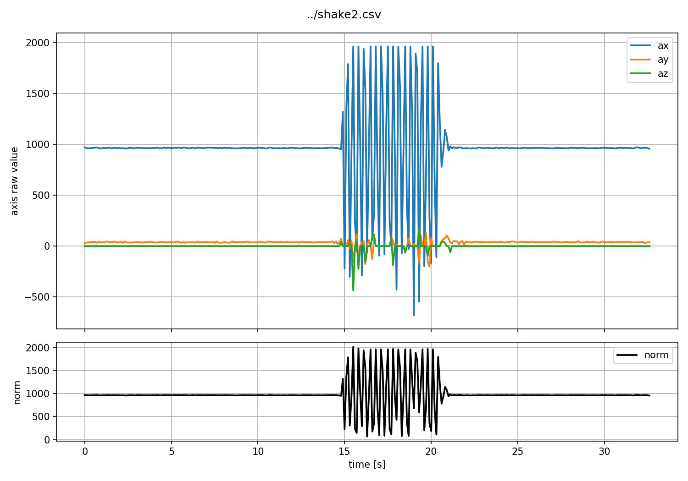

# IMU ログ初期分析

## 目的

取得済みの BNO055 加速度 CSV を Python で可視化し、通常時と揺らした時で差が出そうな特徴量を確認する。

## 入力データ

- CSV: [../bringup/shake2.csv](../bringup/shake2.csv)
- 列: `timestamp_ms, ax, ay, az`
- サンプル数: 327
- 記録時間: 32.6 s
- 平均サンプリング間隔: 100 ms

`shake2.csv` は [../bringup/bno055-accel.md](../bringup/bno055-accel.md) の記録にある通り、100 ms 周期に修正した後のログ。15 秒から 20 秒付近で x 軸方向に揺らしている。

## 可視化

以下のコマンドで `ax, ay, az` とノルムを時系列プロットした。

```powershell
cd projects/catpole-imu-monitor/docs/bringup/plot
uv run python main.py ../shake2.csv -o shake2.png
```



## 比較区間

- 通常区間: 0-10 s
- 振動区間: 15-20 s

時刻は CSV 先頭行の `timestamp_ms` を 0 s として正規化した。

表は [../bringup/plot/feature_table.py](../bringup/plot/feature_table.py) で生成した。

```powershell
cd projects/catpole-imu-monitor/docs/bringup/plot
uv run python feature_table.py ../shake2.csv
```

ここでの「平均絶対変化量」は、隣接するサンプル同士の差分の絶対値を平均した値。
「最大絶対変化量」は、その隣接差分の絶対値の最大値。

| 区間 | 軸 | n | RMS | 分散 | 平均絶対変化量 | 最大絶対変化量 |
| --- | --- | ---: | ---: | ---: | ---: | ---: |
| 通常 0-10 s | ax | 100 | 963.03 | 7.08 | 2.75 | 8.00 |
| 通常 0-10 s | ay | 100 | 37.40 | 13.37 | 4.11 | 14.00 |
| 通常 0-10 s | az | 100 | 1.00 | 0.00 | 0.00 | 0.00 |
| 通常 0-10 s | norm | 100 | 963.76 | 7.01 | 2.74 | 8.31 |
| 振動 15-20 s | ax | 50 | 1264.78 | 806267.99 | 1302.02 | 2572.00 |
| 振動 15-20 s | ay | 50 | 73.71 | 5493.92 | 73.98 | 281.00 |
| 振動 15-20 s | az | 50 | 87.09 | 7555.88 | 66.53 | 436.00 |
| 振動 15-20 s | norm | 50 | 1269.92 | 551681.42 | 1046.11 | 1882.94 |

## 観察

- 通常区間では `ax` が 960 前後で安定しており、隣接サンプル間の変化量も 3 count 程度に収まっている。
- 振動区間では `ax` と `norm` の分散、平均絶対変化量が通常区間より大きく増えている。
- `az` は通常区間で -1 に張り付いており、 z 軸不調の影響を受けている。そのため、このセンサーで現時点で z 軸単独の特徴量を判断材料にするのは避ける。
- 生の RMS は姿勢による重力成分や軸方向のオフセットを強く含む。今回も通常区間の `ax` RMS が 963 と大きく、揺れの有無だけを表す特徴量としては扱いにくい。

## 特徴量候補

| 大まかな区別のしやすさ | 特徴量 | 何の量であるか | 備考 |
| --- | --- | --- | --- |
| 高 | `mean_abs_delta_norm` | 隣接サンプル間のノルム変化量 | 通常 2.74 に対して振動区間で 1046.11。 |
| 高 | `mean_abs_delta_axis_max` | `ax, ay, az` の平均絶対変化量の最大値 | 揺れ方向が固定でない場合に、どの軸に出ても拾いやすいのではないか。 |
| 高 | `var_norm` | ノルムの分散 | 通常 7.01 に対して振動区間で 551681.42。 |
| 中 | `var_axis_max` | `ax, ay, az` の分散の最大値 | 今回は `ax` に強く出ている。姿勢変化より振動を拾いたい場合に使えるのではないか。 |
| 低 | `rms_raw_norm` | ノルムの生 RMS | 静止姿勢や取り付け向きの影響が大きい。 |

