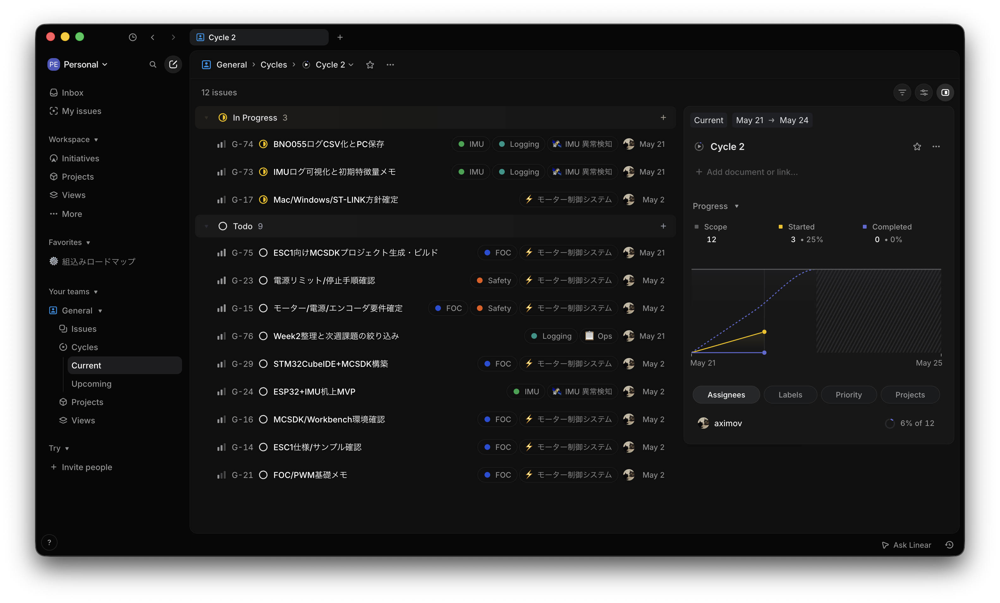

# 2026-05-21

サンプリング周波数が2Hzになっている問題を解決した。ただ az が -1 になりがち問題は未解決なので、明日配線を一度バラして組み直してなお問題が継続するかを確かめたい。

またプロジェクト全体が計画に対して徐々に遅れてきていたので、 Linear を整理してサイクル毎にやるべきチケットを明確にし、現在どれくらい進んでいるのかを見える化した。

Linear をメインにタスク管理をすることにしたので進捗状況はかなり分かりやすくなったが、1点だけ気になった点があるとすれば、 Linear は仕事用ツールなので土日を除外してバーンアップチャートの予測線が引かれていること。これを調整できる設定項目はないようだ。

